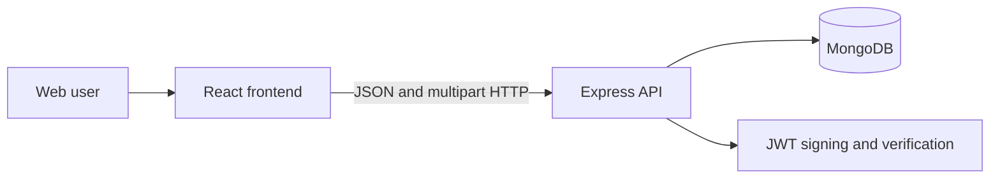

# Project Tracker architecture

> **Status:** Current implementation
>
> **Verification basis:** Working tree based on the current branch

## 1. Executive summary

Project Tracker is a web application for managing projects, members, and tasks. Users sign in, open projects they belong to, and manage tasks on a drag-and-drop board. The board has To do, In progress, Code review, and Completed statuses. Completed is hidden by default and can be shown with a board filter. Tasks can also be filtered by assignee and edited from a task details modal.

The system has a React frontend, an Express and TypeScript API, and MongoDB persistence through Mongoose. The frontend keeps the JWT in browser local storage and sends it as a bearer token on API requests. MongoDB is the source of truth for users, projects, tasks, membership, and image buffers.

The main rule for contributors is that the frontend is not a security boundary. Every protected API operation must authenticate the caller and enforce its permission on the backend.

## 2. System context

- **Web user:** Signs in, manages profile information, works with projects, and edits tasks.
- **React frontend:** Provides routing, navigation, forms, board interactions, filters, and image display.
- **Express API:** Authenticates requests, validates input, applies project and task rules, and returns JSON or image responses.
- **MongoDB:** Stores users, projects, tasks, membership references, and image binary data.
- **JWT:** Carries the user ID and role for seven days after login.

The API starts on `PORT` with a default of `5000`. The frontend calls `REACT_APP_API_URL` when set, otherwise it uses `http://localhost:5000/api`.

## 3. Architectural invariants

1. **Passwords are stored as hashes.** The `User` Mongoose pre-save hook hashes a changed password with bcrypt. Password fields are excluded from normal queries.
2. **Protected API routes require a valid bearer token.** The `authenticate` middleware rejects missing or invalid tokens with `401` and attaches `userId` and `role` to accepted requests.
3. **Administrative operations are restricted.** Creating users, creating projects, adding project members, and removing project members use the admin route guard. Replacing a project's member list is restricted in the project service to the project creator.
4. **Project membership controls project data access.** Project details and project tasks check that the requesting user belongs to the project before returning data.
5. **Tasks belong to projects and use a constrained status set.** The task schema requires a project reference and accepts `todo`, `in_progress`, `code_review`, `completed`, and the legacy `done` value.
6. **Request shapes are validated at API boundaries where schemas are attached.** Zod schemas are applied to login, user, project, and task routes before their controllers execute. The task image and assignment routes have separate handling and do not use the general Zod validation middleware.
7. **The frontend normalizes legacy `done` tasks to Code review.** This keeps existing records visible after the board moved from Done to Code review and Completed.
8. **Uploaded images are limited and type checked.** Multer accepts JPEG, PNG, WebP, and GIF images. Avatar files are limited to 5 MB and task images to 3 MB per file; a task displays and stores at most three images through the upload path.

## 4. Components and dependencies

### Backend

- `backend/src/server.ts` connects to MongoDB and starts the HTTP listener. It does not own route logic.
- `backend/src/app.ts` configures CORS, JSON parsing, route mounts, the health endpoint, and the final error handler.
- `backend/src/routes/` defines the HTTP boundary and composes authentication, role checks, upload handling, and validation.
- `backend/src/controllers/` reads request data, calls services, and formats HTTP responses. Controllers also contain some project membership checks for read and task operations.
- `backend/src/services/` owns database operations and domain checks for authentication, users, projects, and tasks. Services do not own HTTP routing.
- `backend/src/models/` defines the MongoDB documents and indexes for users, projects, and tasks.
- `backend/src/middleware/` owns JWT authentication, admin checks, upload parsing, validation, and error responses.

### Frontend

- `frontend/src/App.tsx` owns route protection based on the token and renders the shared navigation.
- `frontend/src/pages/` owns page-level flows for login, dashboard, projects, the project board, profile, and admin tools.
- `frontend/src/components/` owns reusable task, project, navigation, and modal UI.
- `frontend/src/api/` owns Axios configuration and resource-specific API calls.
- `frontend/src/types/` defines the client-side task, project, user, and authentication shapes.
- `frontend/src/pages/ProjectBoard.tsx` owns board state, status normalization, drag-and-drop updates, assignee filtering, completed-lane visibility, and task refreshes.

Dependencies cross from the frontend to the HTTP API. The backend depends on MongoDB and does not depend on React or browser state. The frontend does not own authorization or persistence policy.

## 5. Critical flows

### Authentication and logout

1. The user submits an email and password to `POST /api/auth/login`.
2. The validation middleware checks the request body.
3. `AuthService` loads the user with the password field, compares the password with bcrypt, and signs a seven-day JWT containing the user ID and role.
4. The frontend stores the token and role in local storage, then reloads the root route.
5. Axios reads the token before each request and adds the bearer header.
6. Logout removes the token and role and performs a full redirect to `/login`, so the route guard cannot keep rendering a stale authenticated page.

### Project and membership management

1. An authenticated admin creates a project through `POST /api/projects`.
2. The service stores the creator as both `createdBy` and the first project member.
3. Admin screens load the current user's projects, users, and current profile in parallel.
4. Member additions and removals update the project membership array. The creator cannot be removed.
5. A member can read a project and its tasks; non-members receive `403` from the relevant service or controller check.

### Task board

1. The project board requests the project and its tasks in parallel.
2. Tasks with the legacy `done` status are normalized to `code_review` in the frontend.
3. The default board shows To do, In progress, and Code review. The Completed lane is rendered only when the user enables Show completed.
4. The assignee filter defaults to All assignees and can select a member or Unassigned. Filtering is client-side over the tasks already loaded for the project.
5. Dragging a task into a lane optimistically changes its status and sends `PUT /api/tasks/:taskId`.
6. Clicking a task opens the edit modal. The modal can update title, description, assignee, and status in one request, then the board reloads the task list.
7. Task image uploads use a separate multipart request. The API stores image buffers in the task document and the frontend loads them through the task image endpoint.

### Profile and images

Authenticated users can update their name and avatar URL, change their password, upload an avatar, and read their own profile. Avatar and task image bytes are stored in MongoDB and served through image endpoints. Image GET routes are public because ordinary browser image elements do not send the API bearer header in this application.

## 6. Interfaces and data

### HTTP API

- `POST /api/auth/login`
- `GET /api/users/me`
- `PUT /api/users/me`
- `PUT /api/users/me/password`
- `POST /api/users/me/avatar`
- `GET /api/users/:userId/avatar`
- `GET /api/users` and `POST /api/users` for admins
- `POST /api/projects`
- `GET /api/projects/mine`
- `GET /api/projects/:projectId`
- `GET /api/projects` for admins
- `POST /api/projects/:projectId/users`
- `DELETE /api/projects/:projectId/users/:userId`
- `PUT /api/projects/:projectId/members`
- `POST /api/tasks`
- `GET /api/tasks/project/:projectId`
- `PUT /api/tasks/:taskId`
- `DELETE /api/tasks/:taskId`
- `PUT /api/tasks/:taskId/assign`
- `POST /api/tasks/:taskId/images`
- `GET /api/tasks/:taskId/images/:imageId`
- `GET /health`

### Stored data

- **User:** name, normalized email, bcrypt password hash, role, avatar URL, optional avatar binary data and content type, timestamps.
- **Project:** name, optional description, creator reference, member references, timestamps.
- **Task:** title, optional description, project reference, optional assignee reference, creator reference, status, timestamps, and up to three image subdocuments containing metadata and binary data.

MongoDB owns identifiers and persistence. The backend owns status validation, membership checks, and password rules. The frontend owns display-only board preferences such as whether Completed is visible and which assignee filter is selected. Those preferences are not persisted.

The current status compatibility rule is that `done` is accepted in the backend for existing records but is displayed as Code review by the frontend. New board updates use `code_review` or `completed`.

## 7. Security and trust boundaries

- Login is the identity entry point. The server signs JWTs with `JWT_SECRET`; the client does not create or verify tokens.
- The frontend and local storage are untrusted. A client-side role check only controls navigation visibility.
- The backend checks authentication on protected routes and checks admin role or project membership where required.
- Request bodies, route parameters, and uploaded files are untrusted. Zod validates the routes where schemas are attached; Multer filters image MIME types and sizes.
- Public image routes expose avatar and task image bytes by identifier. This is an intentional current trust boundary and does not provide access control for image reads.
- Errors are converted to JSON by the global error handler. Development responses may include a stack trace.

## 8. Failure, capacity, and operations

- Startup exits the process when MongoDB connection fails. There is no application-level retry loop.
- The API returns `401` for missing or invalid authentication, `403` for authorization failures, and service-defined `400`, `404`, or `409` errors for validation and domain failures.
- The board uses optimistic status updates. If the API update fails, it alerts the user but does not currently restore the previous task status automatically.
- Frontend API calls generally show page alerts or inline messages on failure. There is no shared retry or offline queue.
- CORS is enabled globally with the default configuration.
- Image storage is memory-buffered during upload and persisted inside MongoDB. This increases document and database size as images accumulate.
- Environment configuration requires `MONGO_URI` and `JWT_SECRET`; `PORT` is optional.
- The repository has separate frontend and backend development commands and a root command that runs both with `concurrently`.

## 9. Verification

- The frontend production build has been run successfully with the bundled Node runtime.
- The frontend test setup uses Jest and React Testing Library, but the checked-in `App.test.tsx` is still the default starter assertion and does not prove the application's current flows.
- The backend has no checked-in automated test suite.
- A backend TypeScript check is currently not clean. It reports existing type errors in controllers, middleware, services, and the Zod type import. The status additions are implemented in the backend source, but a clean backend build remains unverified.
- No automated browser or end-to-end checks are currently documented.
- Database indexes, production deployment behavior, CORS policy, JWT secret rotation, and public image access have not been verified in an environment outside local source inspection.

## 10. Known limitations

- The frontend route guard reads local storage during render rather than from a shared authentication context. Logout works by forcing a full navigation, and authentication state is not managed as a reactive application store.
- The board loads all project tasks and filters assignees in the browser. There is no server-side filtering, pagination, sorting, or search.
- Completed visibility and assignee selection are session-local UI state and reset when the board is reloaded.
- Drag-and-drop status changes are optimistic but lack rollback on failed requests.
- Legacy `done` values remain in the database until a migration is performed.
- Task and avatar image bytes are stored in MongoDB, which is a poor fit for large or high-volume media.
- Image GET endpoints are public and do not check the requesting user's project or account access.
- Project deletion, task deletion UI, task history, comments, notifications, due dates, priorities, and audit logs are not implemented.
- The repository's current automated test coverage does not prove authentication, authorization, board filtering, task editing, uploads, or logout behavior.

## 11. Source map

- [backend/src/server.ts](backend/src/server.ts): database connection and server startup.
- [backend/src/app.ts](backend/src/app.ts): middleware, route mounts, health endpoint, and error handling.
- [backend/src/routes/](backend/src/routes/): API route boundaries.
- [backend/src/middleware/](backend/src/middleware/): authentication, role checks, validation, uploads, and errors.
- [backend/src/models/](backend/src/models/): MongoDB schemas and status constraints.
- [backend/src/services/](backend/src/services/): persistence and domain operations.
- [backend/src/controllers/](backend/src/controllers/): HTTP request and response handling.
- [frontend/src/App.tsx](frontend/src/App.tsx): route protection and shared navigation.
- [frontend/src/pages/ProjectBoard.tsx](frontend/src/pages/ProjectBoard.tsx): board statuses, filters, drag-and-drop, and task refreshes.
- [frontend/src/components/TaskDetailsModal.tsx](frontend/src/components/TaskDetailsModal.tsx): task editing and image upload UI.
- [frontend/src/api/](frontend/src/api/): frontend API clients.
- [frontend/src/types/](frontend/src/types/): client-side data contracts.
